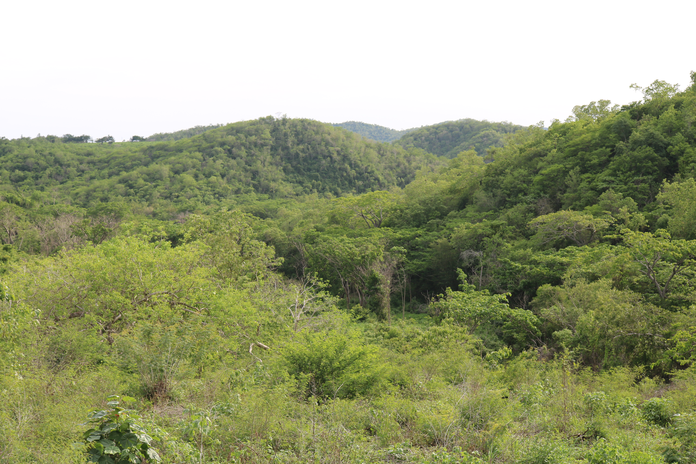
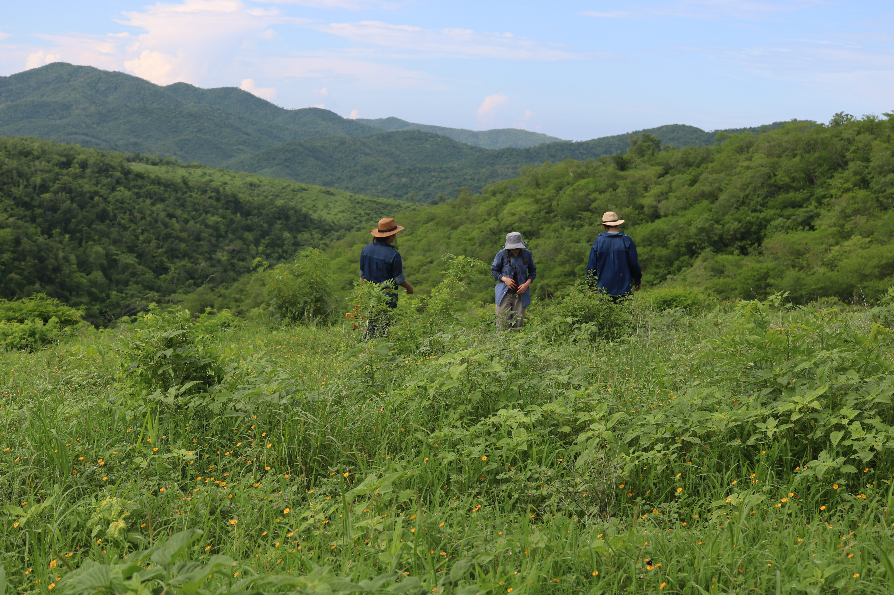
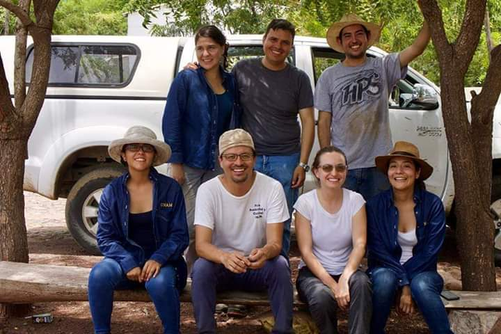

## Proyecto ReserBos - Chamela
### Sucesión secundaria en bosques tropicales: recuperando la biodiversidad, servicios y funciones del ecosistema
 

El objetivo del proyecto es estudiar la dinámica de los bosques tropicales secos secundarios y su manejo para contribuir al mantenimiento de su biodiversidad, sus funciones y asegurar el flujo
de servicios que éstos ofrecen a la sociedad. Específicamente nos centramos en los factores biofísicos y de manejo que determinan la regeneracion de estos bosques. 

Nuestros sitios de muestreos están ubicados en la costa de Jalisco en México, aledaños a la reserva de la Biosfera Chamela-Cuixmala. Allí contamos con un sistema de parcelas permanentes donde realizamos censos de plantas, muestreos de suelo y materia en descomposición. Además realizamos entrevistas semi-estructuradas a los habitantes de la zona con quienes trabajamos. 

 

 

## Posibilidades de tesis

Si quieres desarrollar tu tesis con nosotros, nos interesa investigar sobre: 

1. 
2. 
3. 

Este proyecto es desarrollado en colaboración con el laboratorio de [ biodiversidad y bienestar humano ](http://www.iies.unam.mx/laboratorios/biodiversidad-bienestar-humano/proyectos/#costa-jalisco) del instituto de investigaciones en ecosistemas y sustentabilidad.

 

